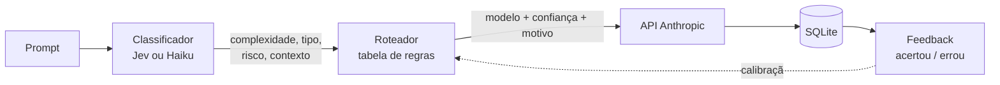

# Jev · Seletor de Modelos Claude

> Dado um prompt, indica qual modelo Claude usar (**Haiku**, **Sonnet** ou **Opus**), executa no modelo escolhido e aprende com o seu feedback.

Critério de escolha: **equilíbrio entre custo e qualidade**. Tarefas simples vão para modelos baratos; tarefas complexas ou de alto risco vão para o mais capaz.

## Como funciona



1. **Classifica** o prompt em 4 características: `complexidade`, `tipo_tarefa`, `risco_erro`, `contexto_longo`.
2. **Roteia** com regras explícitas e auditáveis (nada de caixa-preta).
3. **Executa** o prompt no modelo escolhido e mostra resposta e tokens.
4. **Registra** tudo em SQLite e pergunta se a escolha foi certa.
5. **Calibra**: o histórico de acertos mostra onde as regras precisam mudar.

### Dois classificadores, comparáveis

| Classificador | O que é | Flag |
|---|---|---|
| **Jev** ([TypeSafe AI](https://docs.typesafe.ai)) | Uma chamada com 3 `Choice` + 1 `Noul`; devolve probabilidades que viram a confiança da decisão | `--classificador jev` |
| **Haiku** | Prompt de classificação em JSON validado, com 1 retry e fallback conservador | `--classificador haiku` (padrão) |

Use os dois nos mesmos prompts e compare a taxa de acerto com `router calibrar`.

### Regras de roteamento

Em ordem de prioridade (tabela `REGRAS` em `roteador.py`):

| # | Condição | Modelo |
|---|---|---|
| 1 | complexidade alta **ou** risco de erro alto | Opus |
| 2 | tarefa agentic **ou** contexto longo | Sonnet (piso) |
| 3 | complexidade baixa **e** risco baixo | Haiku |
| 4 | demais casos | Sonnet |

## Instalação

Requisitos: Python 3.11+, uma chave da [Anthropic](https://console.anthropic.com) e, para o classificador Jev, uma chave da [TypeSafe](https://docs.typesafe.ai).

```bash
git clone https://github.com/luanagcouto-eng/Jev-SeletorModelosIAClaude.git
cd Jev-SeletorModelosIAClaude

python -m venv .venv
source .venv/bin/activate        # Windows: .venv\Scripts\activate
pip install -e ".[dev]"

cp .env.example .env             # Windows: copy .env.example .env
```

Preencha o `.env`:

```
ANTHROPIC_API_KEY=sk-ant-...
TYPESAFE_API_KEY=apikey_...
```

> Confira os `id_api` dos modelos em `src/router/catalogo.py` na [documentação da Anthropic](https://docs.claude.com) antes do primeiro uso. Eles ficam só nesse arquivo.

## Uso

```bash
# Só a decisão, sem chamar o modelo final
router rotear "Resuma este e-mail em 3 linhas" --dry-run --classificador jev

# Decisão + resposta do modelo escolhido
router rotear "Refatore este módulo para injetar dependências"

# Forçar um modelo
router rotear "Revise este contrato" --forcar opus
```

Após a resposta, o CLI pergunta **"Acertou?"**. Se a resposta for `n`, informe o modelo que seria o ideal.

| Comando | Descrição |
|---|---|
| `router rotear "..."` | Classifica, roteia, executa e pede feedback |
| `router historico [--limite N]` | Últimas execuções |
| `router feedback ID s\|n [--preferido MODELO]` | Feedback depois da execução |
| `router calibrar` | Taxa de acerto por modelo, erros recentes e alerta quando um modelo erra mais de 30% (com 10+ amostras) |

Guia passo a passo para Windows em [`GUIA.md`](GUIA.md).

## Estrutura

```
src/router/
├── catalogo.py          # modelos e IDs da API (dados, não código)
├── roteador.py          # Caracteristicas -> Decisao (função pura)
├── classificador.py     # classificador via Haiku
├── classificador_jev.py # classificador via Jev (TypeSafe)
├── cliente.py           # chamada à API Anthropic
├── registro.py          # SQLite: execuções e feedback
├── servico.py           # orquestra o pipeline
└── cli.py               # interface de linha de comando (typer)
docs/specs/              # specs de cada módulo (SDD)
tests/                   # 41 testes, sem rede
```

## Desenvolvimento

Projeto conduzido com **SDD** (Spec-Driven Development): cada módulo tem uma spec em `docs/specs/` escrita antes do código.

```bash
pytest
```

Os testes usam clientes falsos: não consomem créditos nem exigem chaves.

## Decisões de projeto

- **Regras como dados**: a tabela `REGRAS` é o único lugar a editar para calibrar.
- **Roteador puro**: sem I/O, fácil de testar e de reaproveitar em outra interface (API, Power Automate).
- **Falha segura**: se a classificação falhar, o fallback leva a Sonnet, o meio-termo.
- **Segurança**: chaves só no `.env` (fora do git); consultas SQL parametrizadas; o prompt do usuário é tratado como dado, nunca como instrução, no classificador.

## Status e roadmap

- [x] Núcleo, CLI, registro e feedback
- [x] Classificadores Haiku e Jev
- [ ] Validação ponta a ponta com chaves reais e comparação Jev × Haiku
- [ ] Calibração automática a partir do feedback (ajuste de regras / few-shot)
- [ ] Interface web/API (integração com Power Automate / Power Apps)
